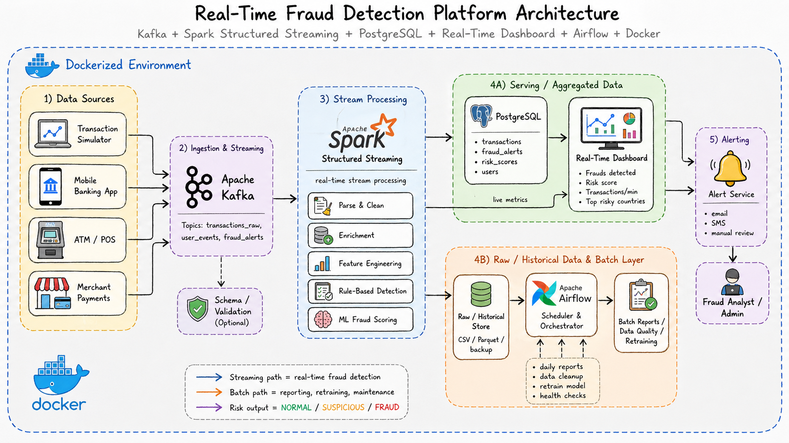
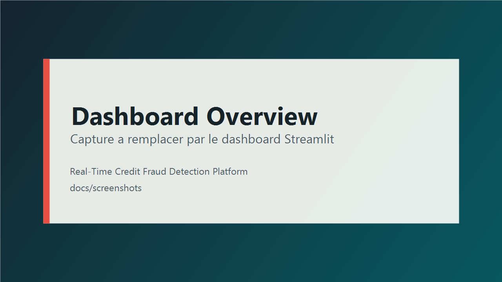
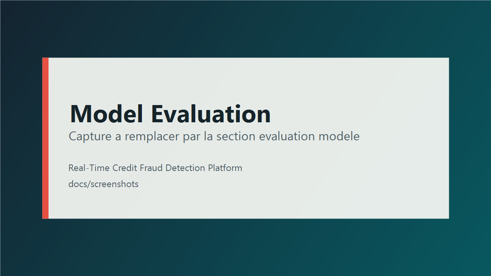

# Real-Time Credit Fraud Detection Platform

Big Data platform for real-time banking fraud detection. This project combines Kafka, Spark Structured Streaming, PostgreSQL, Airflow, Streamlit, and a Machine Learning model to detect, score, store, visualize, and audit suspicious transactions.

## Project Overview

This project simulates a complete fraud detection pipeline for credit card transactions.

The objective is to process a real-time transaction stream, calculate a hybrid risk score, and classify each transaction into three statuses:

- `NORMAL`: transaction considered legitimate.
- `SUSPICIOUS`: transaction that should be monitored or reviewed.
- `FRAUD`: highly suspicious transaction with alert generation.

The platform covers the full lifecycle:

- transaction ingestion through Kafka;
- streaming processing with Apache Spark;
- scoring using business rules, user behavior, and an ML model;
- storage in PostgreSQL;
- real-time visualization with Streamlit;
- reporting, data quality checks, and model evaluation with Airflow.

## Architecture

The global flow is as follows:

```text
Dataset / Simulator
        |
        v
Python Producer
        |
        v
Kafka topic: transactions_raw
        |
        v
Spark Structured Streaming
        |
        +--> Rule-based scoring
        +--> Behavior scoring
        +--> ML probability
        +--> Hybrid final_score
        |
        v
PostgreSQL
        |
        +--> Streamlit Dashboard
        +--> Airflow DAGs
        +--> CSV reports
```

Visual schema:



Main local services:

| Service | URL |
|---|---|
| Spark Master | http://localhost:18081 |
| Spark Worker | http://localhost:18082 |
| Kafka UI | http://localhost:8085 |
| PgAdmin | http://localhost:5050 |
| Airflow | http://localhost:8088 |
| Streamlit Dashboard | http://localhost:8501 |

## Technologies Used

| Technology | Role |
|---|---|
| Docker Compose | Local service orchestration |
| Apache Kafka | Real-time message broker |
| Zookeeper | Kafka coordination |
| Apache Spark 3.5.1 | Streaming processing and ML training |
| Spark MLlib | Random Forest model |
| PostgreSQL 16 | Storage for transactions, scores, and alerts |
| PgAdmin | PostgreSQL administration |
| Apache Airflow 2.9.3 | Report and data quality orchestration |
| Streamlit | Real-time analytical dashboard |
| Plotly | Interactive visualizations |
| Python | Producers, dashboard, DAGs, and ML scripts |
| pandas / psycopg2 | Reporting, SQL queries, and CSV exports |

## Project Structure

```text
credit-fraud-detection/
|
|-- airflow/
|   `-- dags/
|       |-- daily_fraud_report_dag.py
|       |-- data_quality_dag.py
|       |-- model_evaluation_report_dag.py
|       `-- repair_missing_alerts_dag.py
|
|-- dashboard/
|   |-- app.py
|   `-- requirements.txt
|
|-- data/
|   |-- raw/
|   |   `-- creditcard.csv
|   `-- reports/
|       |-- fraud_summary_*.csv
|       |-- data_quality_report_*.csv
|       `-- model_evaluation_*.csv
|
|-- docs/
|   |-- architecture.png
|   |-- screenshots/
|   |   |-- dashboard_overview.png
|   |   |-- model_evaluation.png
|   |   |-- airflow_dags.png
|   |   `-- kafka_messages.png
|   `-- demo_scenario.md
|
|-- ml/
|   |-- train_model.py
|   `-- models/
|       |-- fraud_rf_pipeline/
|       `-- metrics.json
|
|-- postgres/
|   `-- init.sql
|
|-- producer/
|   |-- dataset_replay_producer.py
|   |-- transaction_producer.py
|   `-- requirements.txt
|
|-- spark/
|   |-- Dockerfile
|   |-- requirements.txt
|   `-- jobs/
|       `-- fraud_streaming_job.py
|
|-- docker-compose.yml
|-- .env
`-- README.md
```

## Installation

### Prerequisites

- Docker Desktop or Docker Engine with Docker Compose.
- Python 3.10+ to run the producer and dashboard locally.
- Git.
- The `creditcard.csv` dataset placed in `data/raw/creditcard.csv`.

### Starting the Environment

Build and start the services:

```bash
docker compose up -d --build
```

Check the containers:

```bash
docker compose ps
```

Create the Kafka topic if needed:

```bash
docker exec -it fraud-kafka kafka-topics \
  --bootstrap-server fraud-kafka:29092 \
  --create \
  --if-not-exists \
  --topic transactions_raw \
  --partitions 1 \
  --replication-factor 1
```

Install local Python dependencies:

```bash
pip install -r producer/requirements.txt
pip install -r dashboard/requirements.txt
```

## Running the Project

### 1. Train the ML Model

The Random Forest model is trained with Spark using the `creditcard.csv` dataset.

```bash
docker exec -it fraud-spark-master /opt/spark/bin/spark-submit \
  --master spark://fraud-spark-master:7077 \
  /opt/spark/ml/train_model.py
```

The model is saved in:

```text
ml/models/fraud_rf_pipeline
```

The metrics are saved in:

```text
ml/models/metrics.json
```

### 2. Run the Spark Streaming Job

```bash
docker exec -it fraud-spark-master /opt/spark/bin/spark-submit \
  --master spark://fraud-spark-master:7077 \
  --packages "org.apache.spark:spark-sql-kafka-0-10_2.12:3.5.1,org.postgresql:postgresql:42.7.3" \
  /opt/spark/fraud_app/jobs/fraud_streaming_job.py
```

### 3. Run the Kafka Producer

Recommended mode for the demo, using real dataset labels:

```bash
python producer/dataset_replay_producer.py
```

Simple simulation mode:

```bash
python producer/transaction_producer.py
```

### 4. Run the Dashboard

```bash
streamlit run dashboard/app.py
```

Then open:

```text
http://localhost:8501
```

### 5. Use Airflow

Airflow is available at:

```text
http://localhost:8088
```

Default credentials:

```text
username: admin
password: admin
```

## Pipeline Workflow

### 1. Transaction Generation or Replay

Two producers are available:

- `producer/transaction_producer.py` generates synthetic transactions.
- `producer/dataset_replay_producer.py` replays the `creditcard.csv` dataset and enriches each row with business fields: user, country, merchant category, payment method, device, IP address, and real label.

The producer sends JSON messages to the Kafka topic:

```text
transactions_raw
```

### 2. Kafka Ingestion by Spark

The job `spark/jobs/fraud_streaming_job.py` reads the Kafka topic in streaming mode, parses JSON messages, cleans the required fields, and transforms the timestamp into a usable column.

Invalid or incomplete transactions are filtered:

- `transaction_id` is required;
- `user_id` is required;
- `amount` is required;
- `event_time` is required.

### 3. Scoring and Decision

Spark then calculates:

- a business rule score;
- a behavior score;
- an ML probability;
- a final hybrid score;
- a final status: `NORMAL`, `SUSPICIOUS`, or `FRAUD`.

### 4. PostgreSQL Storage

The results are written into three tables:

- `transactions`: enriched transactions and final decision;
- `risk_scores`: detailed scoring components;
- `fraud_alerts`: alerts for suspicious or fraudulent transactions.

## Hybrid Scoring Explanation

The hybrid scoring engine combines three complementary approaches.

### 1. Rule-Based Scoring

Business rules assign points based on risk signals:

| Signal | Rule | Score |
|---|---:|---:|
| Very high amount | `amount > 10000` | 40 |
| High amount | `amount > 5000` | 30 |
| Unusual country | `country != usual_country` | 20 |
| Risky merchant category | Crypto, Luxury, Gaming, Gambling | 15 |
| Night transaction | between 00:00 and 05:00 | 10 |
| Suspicious device | device containing `D-8` or `D-9` | 15 |
| Frequency | reserved for future extension | 0 |

These signals form the `rule_score`.

### 2. Behavior Scoring

The behavior score compares the transaction amount with the user's usual average amount:

| `amount_vs_avg_user` Ratio | Score |
|---:|---:|
| `>= 10` | 30 |
| `>= 5` | 20 |
| `>= 3` | 10 |
| `< 3` | 0 |

This score helps detect unusual transactions even when they do not trigger a strong alert alone.

### 3. ML Probability

The Spark ML model uses a `RandomForestClassifier` trained on the following variables:

```text
Time, V1, V2, ..., V28, Amount
```

The model produces `ml_probability`, which represents the probability that a transaction is fraudulent.

### 4. Final Score

The final score combines the three signals:

```text
final_score = 0.35 * rule_score
            + 0.45 * ml_score
            + 0.20 * behavior_score
```

With:

```text
ml_score = ml_probability * 100
```

### 5. Final Decision

A transaction is classified as `FRAUD` if:

```text
final_score >= 60
```

or if:

```text
rule_score >= 50 and ml_probability >= 0.10
```

A transaction is classified as `SUSPICIOUS` if:

```text
final_score >= 35
```

or if:

```text
ml_probability >= 0.08
```

or if:

```text
rule_score >= 40
```

Otherwise, it is classified as `NORMAL`.

## Airflow DAGs

Airflow DAGs automate reporting, quality control, and maintenance.

| DAG | Frequency | Role |
|---|---|---|
| `daily_fraud_report_dag` | Daily | Generates global fraud reports |
| `data_quality_dag` | Daily | Checks data consistency |
| `model_evaluation_report_dag` | Daily | Calculates precision, recall, F1-score, and accuracy |
| `repair_missing_alerts_dag` | Manual | Repairs missing alerts |

Recommended order for a demonstration:

```text
repair_missing_alerts_dag
data_quality_dag
daily_fraud_report_dag
model_evaluation_report_dag
```

Reports are exported to:

```text
data/reports/
```

Examples of generated files:

- `fraud_summary_*.csv`
- `fraud_status_distribution_*.csv`
- `fraud_details_*.csv`
- `fraud_top_countries_*.csv`
- `data_quality_report_*.csv`
- `model_evaluation_metrics_*.csv`
- `model_evaluation_distribution_*.csv`
- `model_top_predictions_*.csv`

## Dashboard

The Streamlit dashboard monitors the pipeline in real time.

Main features:

- KPIs: total transactions, normal, suspicious, fraud, fraud amount;
- averages for `ml_probability`, `behavior_score`, and `final_score`;
- status distribution;
- top suspicious countries;
- `final_score` and `ml_probability` histograms;
- behavior score distribution;
- model evaluation: precision, recall, F1-score, accuracy;
- `actual_label` vs `transaction_status` matrix;
- fraud timeline per minute;
- latest processed transactions;
- latest alerts.

Planned screenshots:





## Expected Results

### ML Model

The metrics saved in `ml/models/metrics.json` indicate:

| Metric | Value |
|---|---:|
| Model type | Spark ML RandomForestClassifier |
| Total rows | 284807 |
| Normal transactions | 284315 |
| Frauds | 492 |
| AUC | 0.9687 |
| F1 | 0.9993 |

### Observed Hybrid Evaluation

The report `data/reports/model_evaluation_metrics_2026-05-04_14-08-36.csv` contains:

| Metric | Value |
|---|---:|
| True positives | 168 |
| False positives | 38 |
| True negatives | 521 |
| False negatives | 0 |
| Precision | 0.8155 |
| Recall | 1.0000 |
| F1-score | 0.8984 |
| Accuracy | 0.9477 |

Interpretation:

- Recall is excellent in this run: no labeled fraud was missed.
- Precision shows that some false positives still exist.
- This behavior is consistent with fraud detection systems: it is often better to review too many alerts than to let a fraud pass undetected.

## Additional Documentation

- Demo scenario: [docs/demo_scenario.md](docs/demo_scenario.md)
- Screenshots: `docs/screenshots/`
- CSV reports: `data/reports/`
